# aws-spot-price

CLI utility to list current global AWS EC2 Spot Instance prices. Requires valid AWS Access & Secret keys.

## Example

## Options

### --instanceTypes | -i

Type of EC2 instance to filter. Accepts multiple string values.
Enter valid EC2 instance type name. e.g. `-i t3.nano t3a.nano`

### --families | -f

EC2 Family type (`c4`, `c5`, etc..). Accepts multiple string values. Requires `--sizes` option to be used together.
Internally, `--families` and `--sizes` option will build list of EC2 instance types.
For example, `-f c4 c5 -s large xlarge` is equivalent to `-i c4.large c5.large c4.xlarge c5.xlarge`.

### --sizes | -s

EC2 sizes (`large`, `xlarge`, etc..). Accepts multiple string values. Requires `--families` option to be used together.
See [`--families`](#families) section for more detail.

### --limit | -l

Limits list of price information items to be returned.

### --priceMax | -p

Maximum price.

### --productDescriptions | -d

Instance product description to filter. Accepts multiple string values.
You can use `linux` or `windows` (all in lowercase) as wildcard.

### --accessKeyId

Specific AWS Access Key ID. Requires `--secretAccessKey` option to be used together.

### --secretAccessKey

Specific AWS Secret Access Key. Requires `--accessKeyId` option to be used together.
